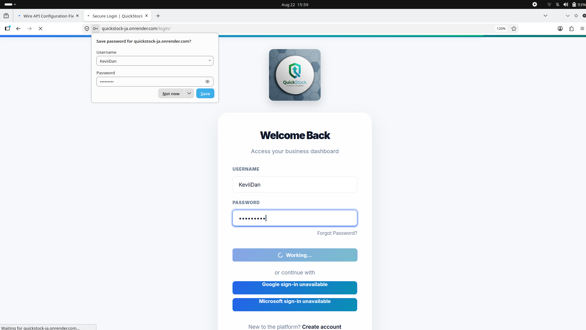

# QuickStock JA - Production Readiness Checklist

This document provides a comprehensive checklist for deploying QuickStock JA to production.

## Pre-Deployment Checklist

### ✅ Security

- [x] **HTTPS Enforcement**
  - [x] Non-local production API URLs require HTTPS
  - [x] HTTPS enforcement in production mode
  - [x] SSL certificate configured for domain

- [x] **Authentication & Authorization**
  - [x] API token authentication implemented
  - [x] Role-based access control (Admin, Manager, Cashier)
  - [x] Token expiration handling
  - [x] Secure token storage using OS keyring

- [x] **Data Protection**
  - [x] Sensitive data encrypted at rest (SecureCache)
  - [x] No plaintext credentials stored
  - [x] API tokens stored in OS keyring
  - [x] Database credentials in environment variables only

- [x] **Input Validation**
  - [x] TRN validation (9-digit Jamaican format)
  - [x] Quantity validation (0 to MAX_DB_QUANTITY)
  - [x] Price validation (non-negative decimals)
  - [x] SKU validation and sanitization

### ✅ Configuration Management

- [x] **Environment Files**
  - [x] `.env.example` created for Desktop UI
  - [x] `.env.example` exists for Backend
  - [x] `.env.production` template available
  - [x] Sensitive values never committed to git

- [x] **Settings Validation**
  - [x] Django fails fast on missing production settings
  - [x] Required settings validated at startup
  - [x] Default values for development mode

### ✅ Logging & Monitoring

- [x] **Application Logging**
  - [x] Rotating file handlers (10MB max, 5 backups)
  - [x] Structured log format with timestamps
  - [x] Different log levels (DEBUG, INFO, WARNING, ERROR)
  - [x] Cross-platform log directory support

- [x] **Health Monitoring**
  - [x] `/api/health/` endpoint implemented
  - [x] Database connectivity checks
  - [x] Migration status verification
  - [x] Storage writability checks

### ✅ Database

- [x] **Schema Management**
  - [x] All migrations applied and tested
  - [x] Migration check command available
  - [x] Database constraints properly defined

- [x] **Backup & Recovery**
  - [x] Backup script (`scripts/backup_db.sh`)
  - [x] Restore script (`scripts/restore_db.sh`)
  - [x] Cron job template for automated backups

### ✅ API Architecture

- [x] **API-First Design**
  - [x] All database operations through REST API
  - [x] Direct database access removed from desktop client
  - [x] Offline mode with sync queue
  - [x] Atomic file operations for data integrity

- [x] **Rate Limiting**
  - [x] Login rate limiting (configurable attempts/window)
  - [x] API rate limiting headers
  - [x] Graceful degradation when limits exceeded

## Deployment Checklist

### Backend Deployment

- [ ] **Server Setup**
  - [ ] Ubuntu/Debian server with SSH access
  - [ ] Python 3.8+ installed
  - [ ] MySQL 8.0+ installed and configured
  - [ ] Nginx installed
  - [ ] SSL certificate (Let's Encrypt)

- [ ] **Application Setup**
  - [ ] Clone repository to `/srv/quickstock/current`
  - [ ] Create virtual environment
  - [ ] Install Python dependencies
  - [ ] Copy production env to `/etc/quickstock/quickstock.env`
  - [ ] Configure environment variables

- [ ] **Database Setup**
  - [ ] Create production database
  - [ ] Create database user with limited privileges
  - [ ] Run migrations (`python manage.py migrate`)
  - [ ] Create superuser for admin access

- [ ] **Static Files**
  - [ ] Run `python manage.py collectstatic`
  - [ ] Verify Nginx serves static files

- [ ] **Gunicorn Configuration**
  - [ ] Copy `deploy/quickstock.service` to systemd
  - [ ] Configure Gunicorn workers/threads
  - [ ] Test Gunicorn socket connectivity

- [ ] **Nginx Configuration**
  - [ ] Copy `deploy/nginx-quickstock.conf`
  - [ ] Update domain names
  - [ ] Update SSL certificate paths
  - [ ] Test Nginx configuration
  - [ ] Enable site and reload Nginx

- [x] **Security Hardening**
  - [x] Set `DJANGO_DEBUG=False`
  - [x] Set `DJANGO_SECRET_KEY` to strong random value
  - [x] Configure `DJANGO_ALLOWED_HOSTS`
  - [x] Set `DJANGO_CSRF_TRUSTED_ORIGINS`
  - [x] Enable `SECURE_SSL_REDIRECT`
  - [x] Set `SECURE_HSTS_SECONDS` > 0

- [ ] **Smoke Tests**
  - [ ] Homepage loads over HTTPS
  - [ ] Login page accessible
  - [ ] Admin can log in
  - [ ] `/api/health/` returns healthy status
  - [ ] Static assets load correctly
  - [ ] API endpoints respond correctly

### Desktop Client Deployment

- [ ] **Build Preparation**
  - [ ] Update version number
  - [ ] Test with production API URL
  - [ ] Verify all dependencies are listed

- [ ] **PyInstaller Build**
  - [ ] Run `pyinstaller Inventory_gui.spec`
  - [ ] Test executable on clean system
  - [ ] Verify icon and branding

- [ ] **Distribution**
  - [ ] Create installer (optional)
  - [ ] Include `.env.example`
  - [ ] Include user documentation

## Post-Deployment Checklist

### Monitoring

- [ ] **Log Monitoring**
  - [ ] Set up log aggregation (optional)
  - [ ] Configure alerts for ERROR level logs
  - [ ] Monitor disk space for log files

- [ ] **Performance Monitoring**
  - [ ] Monitor response times
  - [ ] Track API error rates
  - [ ] Monitor database query performance

### Maintenance

- [ ] **Regular Tasks**
  - [ ] Weekly: Review security logs
  - [ ] Monthly: Rotate API tokens
  - [ ] Quarterly: Update dependencies
  - [ ] Annually: Security audit

- [ ] **Backup Verification**
  - [ ] Test restore procedure monthly
  - [ ] Verify backup integrity
  - [ ] Store backups off-site

## Rollback Procedure

If deployment fails:

1. **Immediate Actions**
   - [ ] Stop Gunicorn service
   - [ ] Restore previous release symlink
   - [ ] Restart Gunicorn
   - [ ] Reload Nginx

2. **Database Rollback**
   - [ ] Restore from pre-deployment backup
   - [ ] Run reverse migrations if needed

3. **Verification**
   - [ ] Test critical functionality
   - [ ] Verify data integrity
   - [ ] Monitor for errors

## Emergency Contacts

| Role | Contact |
|------|---------|
| Technical Lead | [Name/Email] |
| DevOps | [Name/Email] |
| Security | [Name/Email] |

## Version Information

| Component | Version |
|-----------|---------|
| Django | 5.2.4 |
| Python | 3.8+ |
| MySQL | 8.0+ |
| Desktop Client | 1.0.0 |

---

**Last Updated:** 2026  
**Document Version:** 1.0
